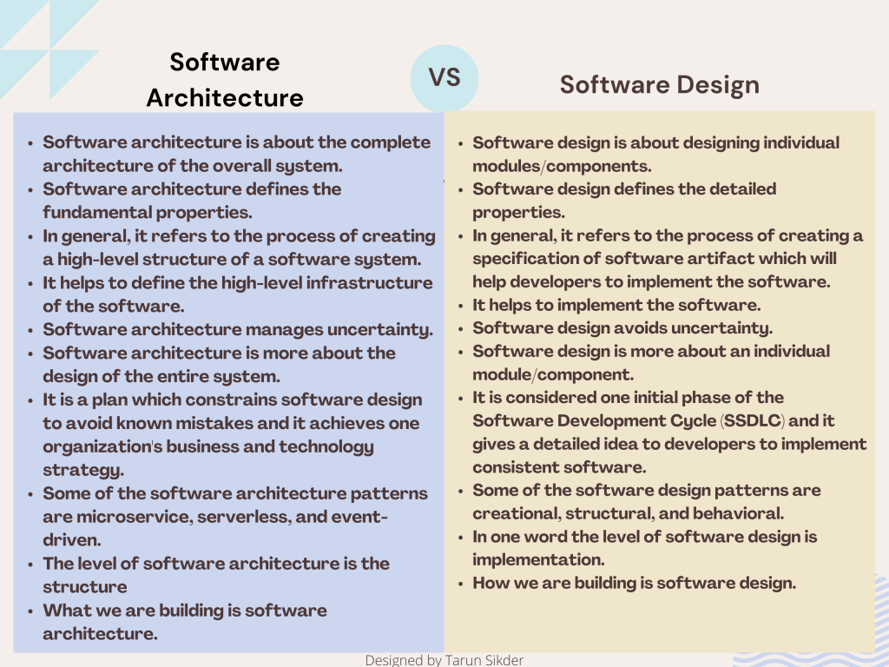
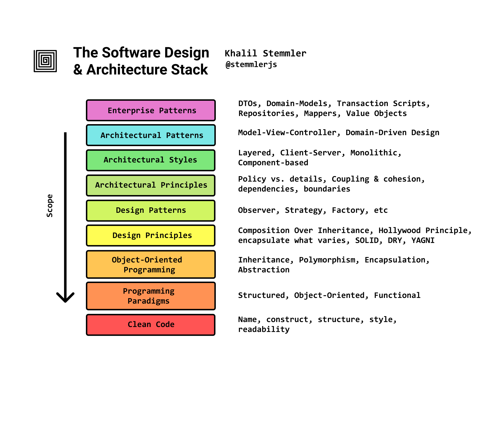

# Arquitetura de Software

## Sumário
- [Introdução](#introdução)
    - [O que é Arquitetura de Software?](#o-que-é-arquitetura-de-software)
    - [Níveis de Arquitetura](#níveis-de-arquitetura)

# Introdução
## O que é Arquitetura de Software?
**Arquitetura de Software vs Design de Software**

Quando feitos corretamente, se economiza tempo e dinheiro.

**Arquitetura de Software**: é o **o que** construímos.

- Alto nível
- Nível de estrutura e comportamento geral do sistema
- Díficil de mudar
- Exemplos de software architecture patterns:
event-driven, serverless, microservices, layered.

**Design de Software**: é o **como** construímos.
- Baixo nível
- Fácil de mudar
- Nível de implementação individual de componentes
- Exemplos de software design patterns:
singleton, factory, observer, adapter.

> Arquitetura de software é uma skill, não um cargo.

## Níveis de Arquitetura
- **Enterprise Level**:
    - Alto nível
    - Envolve múltiplas soluções de negócio
    - Comunição através de toda organização
- **Solution Level**:
    - Nível intermediário
    - Envolve uma solução de negócio
    - Comunicação entre times de desenvolvimento
- **Application Level**:
    - Baixo nível
    - Envolve uma aplicação
    - Comunicação entre desenvolvedores da mesma equipe
    
